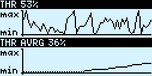

# opentx-lua-running-graphs

**Draws a moving line graph from a given source in OpenTX**

Example screens on X7 display with single/multiple graphs ...




... and inside a widget grid*.


>  \**part of the [opentx-lua-widgets](https://github.com/Matze-Jung/opentx-lua-widgets) package*

## Test environment
* OpenTX v2.2.4 on Taranis Q X7, Betaflight 4.0.5 on OmnibusF4 w/ R-XSR
* Companion Sim v2.2.4 (*FrSky platforms only*)

## Download
Please go to the [releases page](https://github.com/Matze-Jung/opentx-lua-running-graphs/releases) to download the latest files.

## Installing
Unzip the files from the release package and drag the contents to your radio. If you do this correctly, the `SCRIPTS` directory will merge with your existing directories, placing the scripts in their appropriate paths.

The `src` directory is not required for use and is only available for maintenance of the code.  While it may work to use this directory, you may encounter memory issues on your transmitter.

How to copy to the Transmitter:

**A**) Bootloader Method
1. Power off your transmitter and power it back on in boot loader mode.
2. Connect a USB cable and open the SD card drive on your computer.
3. Unzip the file and copy the scripts to the root of the SD card.
4. Unplug the USB cable and power cycle your transmitter.

**B**) Manual method (varies, based on the model of your transmitter)
1. Power off your transmitter.
2. Remove the SD card and plug it into a computer
3. Unzip the file and copy the scripts to the root of the SD card.
4. Reinsert your SD card into the transmitter
5. Power up your transmitter.

If you copied the files correctly, you can now go to the `CUSTOM SCRIPTS` screen and select the script `graphs`:
1. Hit the [MENU] button
2. Long-press [PAGE] and repeat til page `CUSTOM SCRIPTS`
3. Select a free slot and [ENT]
4. Select the script `graphs` and [ENT]
5. Press [EXIT] to return.


Go to the telemetry screen setup page and select telemetry pages.

## Setup
Setting up the script as a telemetry page will enable access at the press of a button (on X7/X9 platforms).
1. Hit the [MENU] button and select the model for which you would like to enable the script.
2. While on the `MODEL SELECTION` screen, long-press the [PAGE] button to navigate to the `DISPLAY` page.
3. Move the cursor down to `Screen 1` and hit [ENT].
4. Select the `Script` option and press [ENT].
5. Move the cursor to the script selection field `---` and hit [ENT].
6. Select one of the example telemetry scripts and hit [ENT].
7. Long-press [EXIT] to return to your model screen.


To invoke the script, simply long-press the [PAGE] button from the model screen.

### Memory warning
If you just copied the files, launched the script and a `not enough memory` warning appears, probably restarting the radio is the only thing to do here. If OpenTX still complains, try to delete all `.luac` files and make shure that you've did build OpenTX with the luac-option checked.


## API
#### Functions
`createGraph(id, opts)`

Init and display the graph.

| Option | Type | Description |
| - | - | - |
| **id** | number | Systemwide unique ID of the graph |
| opts.**src** | function/string/number | Data source |
| opts.**max** | number | Largest possible value |
| opts.**min** | number | Smallest possible value |
| opts.**speed** | number *(optional, default `75`)* | Update speed in 100ths second intervals, smaller is faster |
| opts.**style** | number *(optional, default `SOLID` - `DOTTED` at 'min' and 'max' values)* | `SOLID` for a full solid line, `DOTTED` for a dotted line |
| opts.**crit** | number *(optional)* | If set, the line style is `DOTTED` below and `SOLID` above this value. The Y-axis gets a mark at the values position |

---
`getGraphAverage(id)`

Returns average value of graph, specified by `id`.

| Option | Type | Description |
| - | - | - |
| **id** | number | ID of the graph |

#### Trigger
Set input condition for the pause toggle. Relates to all graphs global.

`SCRIPTS/GRAPHS/trigger.lua`

```lua
return {
    pause = {
        func=function()
            return getValue("sa") > 100
        end
    },
}
```
Switch [SA] value greater than 100 toggles pause event. To disable trigger, return false.

## File structure
`SCRIPTS/`
- `GRAPHS/`
 - `graphs.lua` main script
 - `trigger.lua` user inputs
- `MIXES/`
 - `graphs.lua` model script
- `TELEMETRY/` example telemetry screens
 - `exmpl1.lua`
 - `graph.lua`
 - `graphs.lua`
- `WIDGETS/`
 - `graph.lua` widget for the [opentx-lua-widgets](https://github.com/Matze-Jung/opentx-lua-widgets) grid system

## Building from source
- Be sure to have `LUA 5.2`and `Node.js` installed
- Run `npm install` from the root folder to install node modules
- Run `npm start`, `make` or `./bin/build.sh min` from the root folder with appropriate privileges (omit the `min` switch to build without minifying)
- Compiled/minified files will be created at the `obj` folder. Copy the files to your transmitter.
